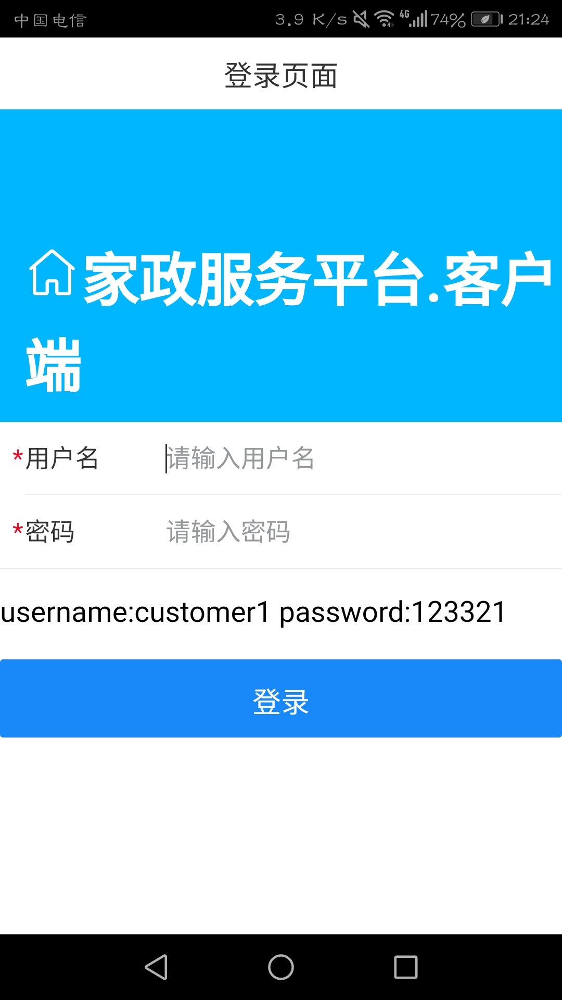
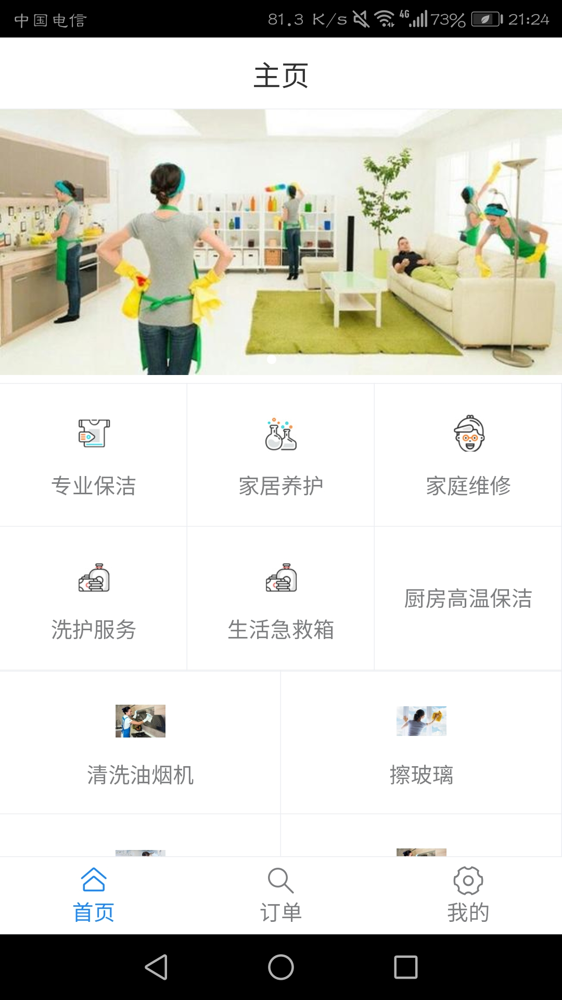
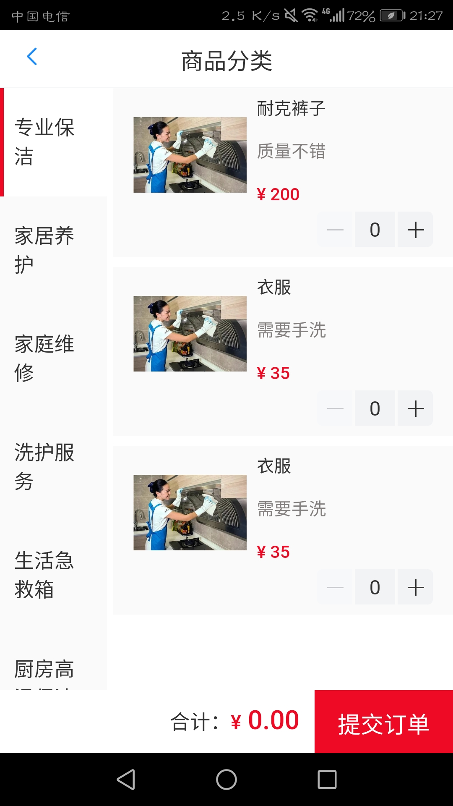
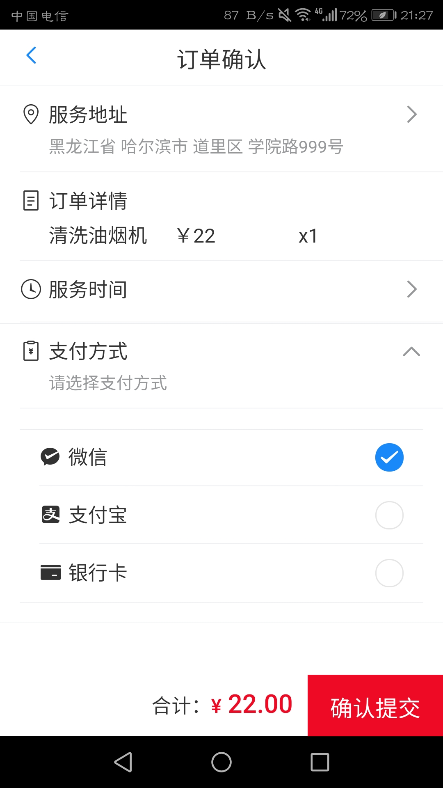
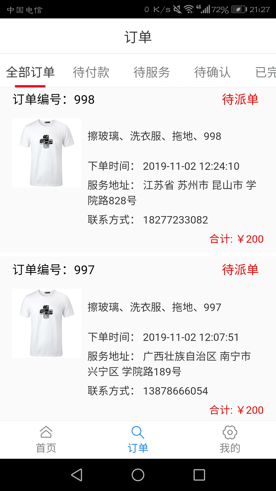
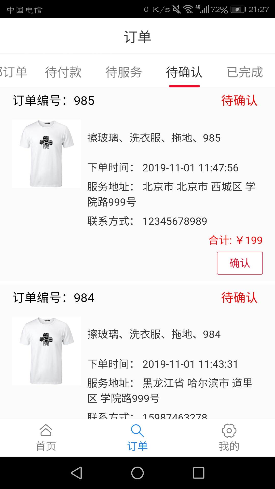
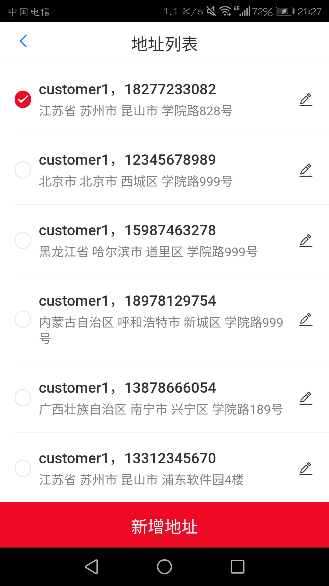

# ej-customer-app

## Project setup
```
npm install
```

### Compiles and hot-reloads for development
```
npm run serve
```

### Compiles and minifies for production
```
npm run build
```

### Customize configuration
See [Configuration Reference](https://cli.vuejs.org/config/).


### APP图片预览

#### 登录页面


#### 首页


#### 产品展示页


#### 确认订单页


#### 全部订单展示页


#### 待确认订单展示页


#### 地址列表展示页


#### 用户页
